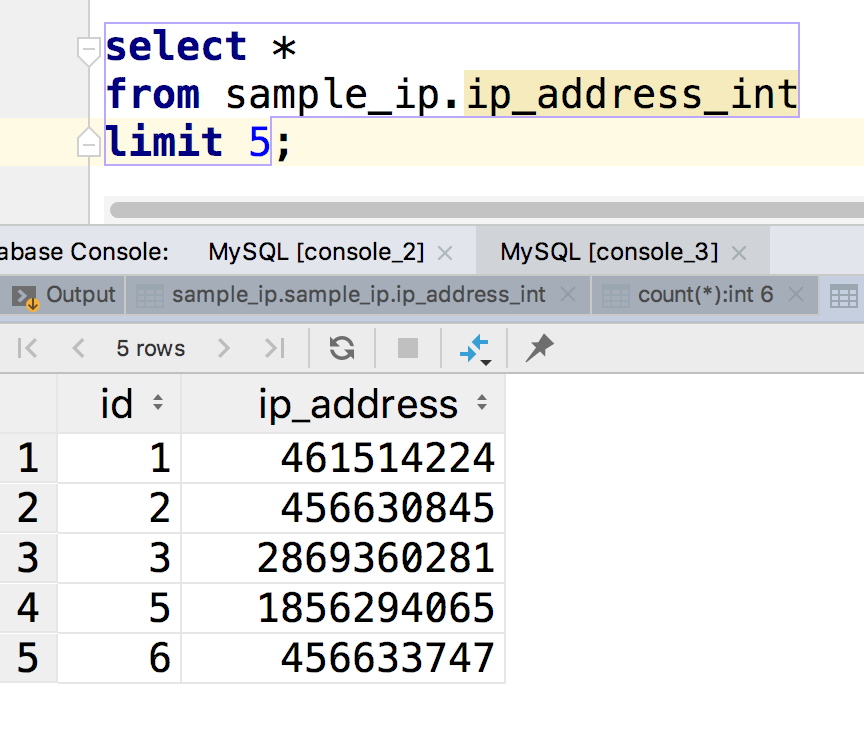
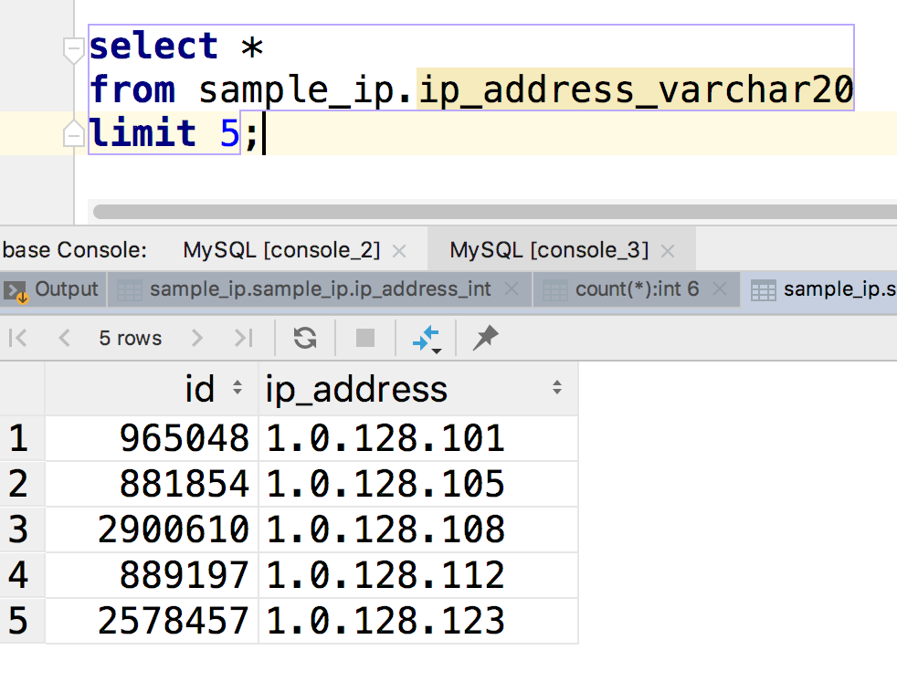

# 数据库样例

这里提供了几个数据库的样例，帮助大家学习数据库的时候使用。项目是根据MIT协议衍生自<https://github.com/michaljuhas/sample-database>。

因为原始数据真的很大，又是压缩又是分割，所以有点麻烦，忍耐一下。

### 来源

在当前目录下，有下面几个文件，数据都存储在其中。

它们是这样来的：

```bash
$ mysqldump -u root --databases sample_ip > sample_ip.sql
$ mysqldump -u root --databases sample_staff > sample_staff.sql

$ tar -zc sample_ip.sql > sample_ip.tar.gz
$ tar -zc sample_staff.sql > sample_staff.tar.gz

$ split -b 50000000 sample_staff.tar.gz "sample_staff_"
```


### 解压文件

我们先通过`tar`命令来解压

``` bash
# 解压 sample_ip.tar.gz
$ tar -xvzf sample_ip.tar.gz sample_ip.sql

# 连接sample_staff
$ cat  sample_staff_aa sample_staff_ab sample_staff_ac > sample_staff.tar.gz
# 然后解压
$ tar -xvzf sample_staff.tar.gz sample_staff.sql

# 这时候应该有这两个文件
$ ls
README.md           sample_ip.tar.gz    sample_staff.tar.gz sample_staff_ab
sample_ip.sql       sample_staff.sql    sample_staff_aa     sample_staff_ac
```


### 创建数据库

导入MySQL之前，先创建对应的数据库

```sql
drop database if exists sample_staff;
drop database if exists sample_ip;
create database sample_staff;
create database sample_ip;
```


### 导入到数据库

```bash
$ mysql -u root sample_ip < sample_ip.sql
$ mysql -u root sample_staff < sample_staff.sql
```


### 数据库的结构

熟悉下数据库的结构

#### sample_ip 的结构

```sql
-- 数据库的结构
mysql > desc sample_ip.ip_address_int;
+------------+------------------+------+-----+---------+-------+
| Field      | Type             | Null | Key | Default | Extra |
+------------+------------------+------+-----+---------+-------+
| id         | int(11)          | NO   | PRI | 0       |       |
| ip_address | int(11) unsigned | YES  |     | NULL    |       |
+------------+------------------+------+-----+---------+-------+

mysql> desc sample_ip.ip_address_varchar20;
+------------+------------------+------+-----+---------+----------------+
| Field      | Type             | Null | Key | Default | Extra          |
+------------+------------------+------+-----+---------+----------------+
| id         | int(11) unsigned | NO   | PRI | NULL    | auto_increment |
| ip_address | varchar(20)      | YES  | MUL | NULL    |                |
+------------+------------------+------+-----+---------+----------------+

mysql> select count(*) from sample_ip.ip_address_int;
+----------+
| count(*) |
+----------+
|  2962653 |
+----------+

mysql> select count(*) from sample_ip.ip_address_varchar20;
+----------+
| count(*) |
+----------+
|  2764687 |
+----------+

```






#### sample_staff

```sql
mysql> SELECT table_name, table_rows
    ->    FROM INFORMATION_SCHEMA.TABLES
    ->    WHERE TABLE_SCHEMA = 'sample_staff';
+-------------------------+------------+
| TABLE_NAME              | TABLE_ROWS |
+-------------------------+------------+
| contract                |     299128 |
| date                    |      19579 |
| department              |          9 |
| department_employee_rel |     330066 |
| department_manager_rel  |         24 |
| employee                |     297383 |
| event_logger            |          0 |
| invoice                 |     308917 |
| month                   |         12 |
| photo                   |    1161530 |
| salary                  |     195212 |
+-------------------------+------------+
```

这个数据库的表接多了，不一一探讨了。


### 其他

- 有些数据可能导不进去 
- 命令行长时间不响应的话，就直接关闭shell就行了。
- 然后检查下数据库。因为各种原因，你最终看到的数据库的内容可能和我不一样，没关系，能用就行
